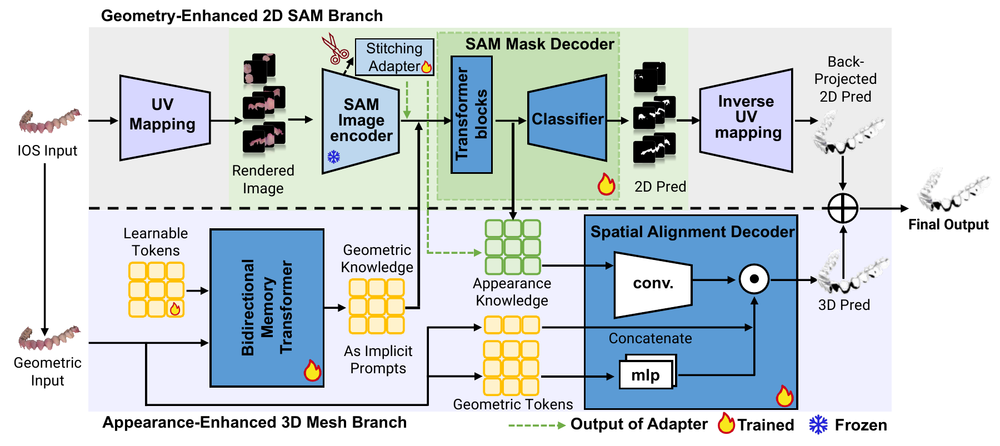
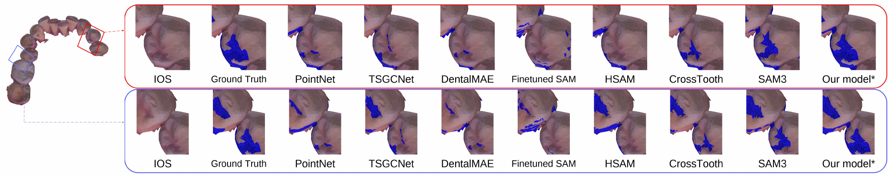

# DentalPSAM

**DentalPSAM: Lifting SAM to Dental Plaque Segmentation with Hybrid 2D-3D
Knowledge Fusion** — MICCAI 2026.

DentalPSAM combines a geometry-enhanced 2D SAM branch and an appearance-enhanced
3D mesh branch to segment dental plaque in intraoral scans.



Architecture shown in the MICCAI paper. The implementation guide is
[inside the package](dentalpsam/README.md).

## Release status

| Resource | Status |
| --- | --- |
| Code | Public research implementation; licensing review pending |
| Dataset | Being organized; not publicly released |
| Task checkpoints | Not publicly released; contact the authors |

Third-party redistribution permission is unresolved; this is not yet a licensed
open-source release. See [Third-party notices](THIRD_PARTY_NOTICES.md).

## Dataset

The dataset is being organized and is not publicly released yet.
Please reach out to the authors regarding data access.
This repository does not distribute patient scans or annotations.

See [Dataset](docs/DATASET.md) for the input layout and annotations.

## Installation

Tested on Linux with Python 3.9.18, PyTorch 2.0.1, CUDA 11.7 and an RTX 3090.
Use Python 3.9 and install PyTorch for your CUDA environment first. For the
tested CUDA version:

```bash
python -m pip install torch==2.0.1 torchvision==0.15.2 --index-url https://download.pytorch.org/whl/cu117
git clone https://github.com/HKU-HealthAI/DentalPSAM.git
cd DentalPSAM
python -m pip install -e .
```

Other Python/PyTorch/CUDA combinations have not been validated. Dependency
ranges in `pyproject.toml` are installation constraints, not a tested matrix.
For a software installation check without study data or weights:

```bash
python -m pip install -e ".[dev]"
pytest -q
```

These are software-contract tests, not a model-performance benchmark.

## Test

Arrange the authorized test data and its matching weights as follows:

```text
data/test/
  meshes/           # coloured, gingiva-removed PLY meshes
  labels/           # matching PLY annotations, required for evaluation
  mesh_ids.txt      # fixed test list supplied with the dataset
checkpoints/
  dentalpsam.pth
  branch3d.pth
  sam.pth
  manifest.json     # author-provided binding of all three weights
```

Task-trained checkpoints are not publicly released yet. Once available to you:

```bash
python test.py --data data/test --weights checkpoints --output results
```

This command verifies the bundle hashes and architecture, regenerates inputs
from the matched 3D weights, predicts, and evaluates; no manual
feature export is needed. Read `results/summary.txt` for the scores and 95% CIs,
or `results/metrics.json` for machine-readable results. Stage progress appears
in the terminal; detailed output is in `results/run.log`.
Use a new output directory for each run. Input data are never overwritten.
Testing does not require retraining. Use `python test.py --help` for options.
Existing prepared caches are not reused. A missing or mismatched bundle manifest
stops the run before preprocessing. See [bundle requirements](docs/TRAINING.md#weight-bundles).

## Train

Put participant-disjoint meshes and annotations in `data/train` and `data/val`,
using the same layout as `data/test`. Train in the following order:

### 1. Train the 3D branch

```bash
python train.py --stage 3d --data data --output outputs/3d
```

### 2. Train DentalPSAM

```bash
python train.py --stage dentalpsam --data data \
  --branch-checkpoint outputs/3d/best.pth --output outputs/dentalpsam
```

Place SAM initialization at `checkpoints/sam.pth` before stage 2. Stage 1 saves
`outputs/3d/best.pth`; stage 2 prepares its 3D inputs automatically and saves
`outputs/dentalpsam/best_model.pth`.
See [Training](docs/TRAINING.md) for prerequisites and options.
The trainers are reference/reconstructed implementations; the
[protocol audit](docs/TRAINING.md#relationship-to-the-paper-experiments) identifies
historically supported settings and deliberate changes.

## MICCAI results

Table 1 of the MICCAI paper, PlaqueIOS test set (120 scans). DSC denotes Dice;
OA denotes overall accuracy. Higher is better for every metric.

| Method | Plaque IoU | Non-plaque IoU | Mean IoU | Plaque DSC | Non-plaque DSC | Mean DSC | OA |
| --- | ---: | ---: | ---: | ---: | ---: | ---: | ---: |
| PointNet | 0.436 | 0.709 | 0.572 | 0.601 | 0.824 | 0.712 | 0.769 |
| TSGCNet | 0.476 | 0.758 | 0.617 | 0.626 | 0.858 | 0.742 | 0.807 |
| DentalMAE | 0.447 | 0.751 | 0.599 | 0.611 | 0.855 | 0.733 | 0.799 |
| Fine-tuned SAM | 0.463 | 0.745 | 0.604 | 0.623 | 0.851 | 0.737 | 0.800 |
| H-SAM | 0.472 | 0.700 | 0.586 | 0.635 | 0.819 | 0.727 | 0.772 |
| CrossTooth | 0.480 | 0.746 | 0.613 | 0.645 | 0.851 | 0.748 | 0.801 |
| Fine-tuned SAM3 | 0.513 | 0.693 | 0.603 | 0.673 | 0.814 | 0.744 | 0.777 |
| **DentalPSAM** | **0.556** | **0.777** | **0.667** | **0.712** | **0.872** | **0.792** | **0.831** |



Qualitative comparison from Figure 3 of the MICCAI paper. Blue marks plaque.

## Code

The [package guide](dentalpsam/README.md) maps model, data, training, and evaluation
modules, including the 3D branch in `dentalpsam/branch3d/`.
`train.py` and `test.py` are the public commands; both support `--help`.
Contributor checks live in `tests/`; they are not additional model entry points.

## Citation

Haoning Jiang et al. *DentalPSAM: Lifting SAM to Dental Plaque Segmentation with
Hybrid 2D-3D Knowledge Fusion.* MICCAI, 2026.
Third-party attribution is retained in [Third-party notices](THIRD_PARTY_NOTICES.md).
