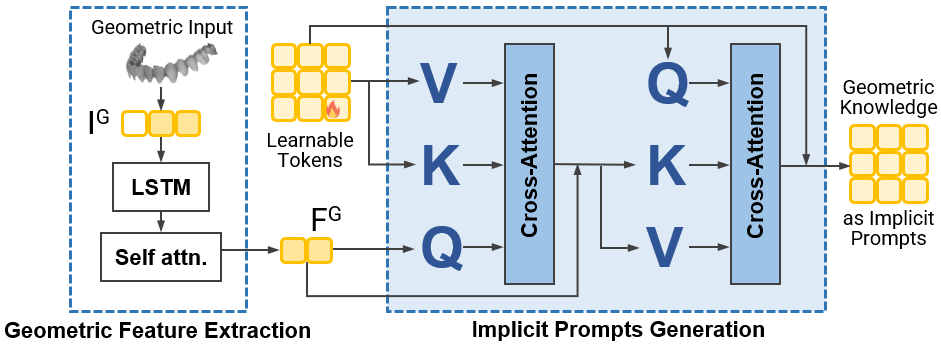

# DentalPSAM implementation

This package contains the model and reusable code for data preparation,
training, prediction, and evaluation. Start with the repository's
[Testing and Training instructions](../README.md); the public commands are
`test.py` and `train.py`. Modules here are not additional command-line entry points.

## Bidirectional Memory Transformer (BMT)

The BMT extracts geometric features and turns them into implicit prompts for
the 2D SAM branch. Figure 2 shows geometric feature extraction on the left
and bidirectional cross-attention with learnable tokens on the right.

In [model.py](model.py), `LSTMModel` encodes the mesh sequence and `MeshEncoder`
uses the vendored `TwoWayTransformer` to construct geometric prompt features.
These features enter `DentalPSAM.forward()` through the mask decoder.

## Where to start

| What you want to understand | Source |
| --- | --- |
| Complete test and two-stage training workflows | [workflows.py](workflows.py), called by [cli.py](cli.py) |
| DentalPSAM's 2D branch, geometric prompts, and 3D decoder | [model.py](model.py) |
| Aligned image, annotation, and mesh-patch loading | [data.py](data.py) |
| Rendering upper, inner, and outer views | [preparation.py](preparation.py) and [uv_projection.py](uv_projection.py) |
| 3D branch model, mesh loader, and training | [branch3d/model.py](branch3d/model.py), [data.py](branch3d/data.py), [training.py](branch3d/training.py) |
| Frozen 3D features and their patch correspondence | [branch3d/features.py](branch3d/features.py) |
| Joint DentalPSAM training and validation | [training.py](training.py), [validation.py](validation.py) |
| Model construction and strict checkpoint loading | [checkpoints.py](checkpoints.py) |
| Per-view prediction and face-order restoration | [inference.py](inference.py), [prediction_io.py](prediction_io.py) |
| Mesh fusion, metrics, confidence intervals, and reports | [evaluation.py](evaluation.py), [reporting.py](reporting.py) |

## How the pieces fit

`test.py` calls `cli.test_main()`, then `workflows.test_model()`. The workflow
checks the fixed evaluation list and checkpoint files, prepares missing views
and 3D features, runs DentalPSAM, and evaluates the saved predictions. Outputs
go to a new directory; the original meshes and annotations are never rewritten.

`train.py --stage 3d` calls the 3D branch trainer. Its selected checkpoint
provides the frozen mesh features used by `train.py --stage dentalpsam`.
The second stage prepares those inputs when requested and trains the joint
model. See [Training](../docs/TRAINING.md) for selection rules and defaults.

The public dataset names are adapted by [_layout.py](_layout.py) to existing
loaders using read-only symlink views. Historical array keys and internal class
names are retained for compatibility; the adapter does not reorder or transform
arrays. See [Dataset](../docs/DATASET.md) for the complete file contract.

## Model and evaluation contracts

- Image patches enter the loader as RGB values in 0–255 and become
  `[B, 3, 256, 256]` tensors. The model resizes them to 1024 × 1024.
- Each mesh patch is left-padded to `[B, 6000, 10]`: nine triangle-coordinate
  values and one auxiliary 3D score. Annotation channels are separate targets,
  never model inputs. Padding and face order must remain unchanged.
- `DentalPSAM.forward()` returns 2D logits in `pred_masks` and per-face logits
  in `pred_mesh`. Inference applies the retained probability conversion and
  restores patch predictions to their recorded view order.
- Checkpoint keys select gated or concatenation fusion; loading is strict.
  Neither model variant is silently substituted for the other.
- Paper evaluation combines back-projected 2D and direct 3D probabilities with
  fixed 0.5/0.5 weights and a strict `> 0.5` decision. It counts valid triangles
  equally, averages per-mesh metrics, and bootstraps participants for 95% CIs.
  It is not physical-area weighting.

The vendored [SAM implementation](segment_anything/README.md) stays in place
for checkpoint compatibility and retains its own license. Developer utilities
are outside the installed package.

## Weights and environment

The weight bundle contains `sam.pth` (SAM ViT-B initialization, originally
`sam_vit_b_01ec64.pth`), `branch3d.pth` (the fixed 3D feature generator), and
`dentalpsam.pth` (task-trained model weights). Prepared features and DentalPSAM
weights must come from compatible runs. Only load trusted checkpoint files.

Dependency ranges are specified in [pyproject.toml](../pyproject.toml). Server
checks used Python 3.9.18, PyTorch 2.0.1 / CUDA 11.7, torchvision 0.15.2,
NumPy 1.26.4, MONAI 1.3.2, OpenCV 4.10.0.84, Open3D 0.18.0, plyfile 1.1.3,
pandas 2.3.3, patchify 0.2.3, scikit-learn 1.6.1, and tqdm 4.66.4 on an
NVIDIA RTX 3090. Supported dependency ranges are not a tested version matrix.
