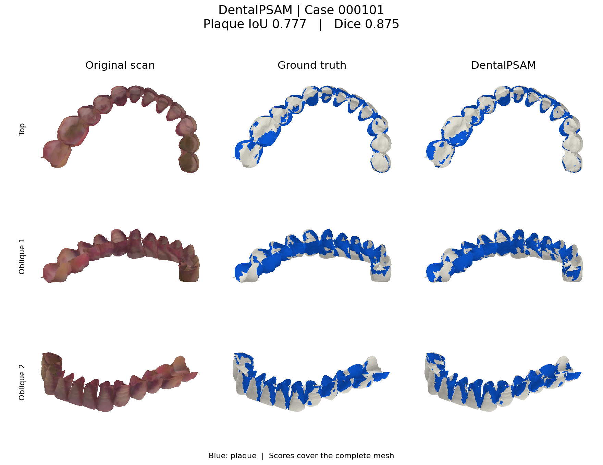
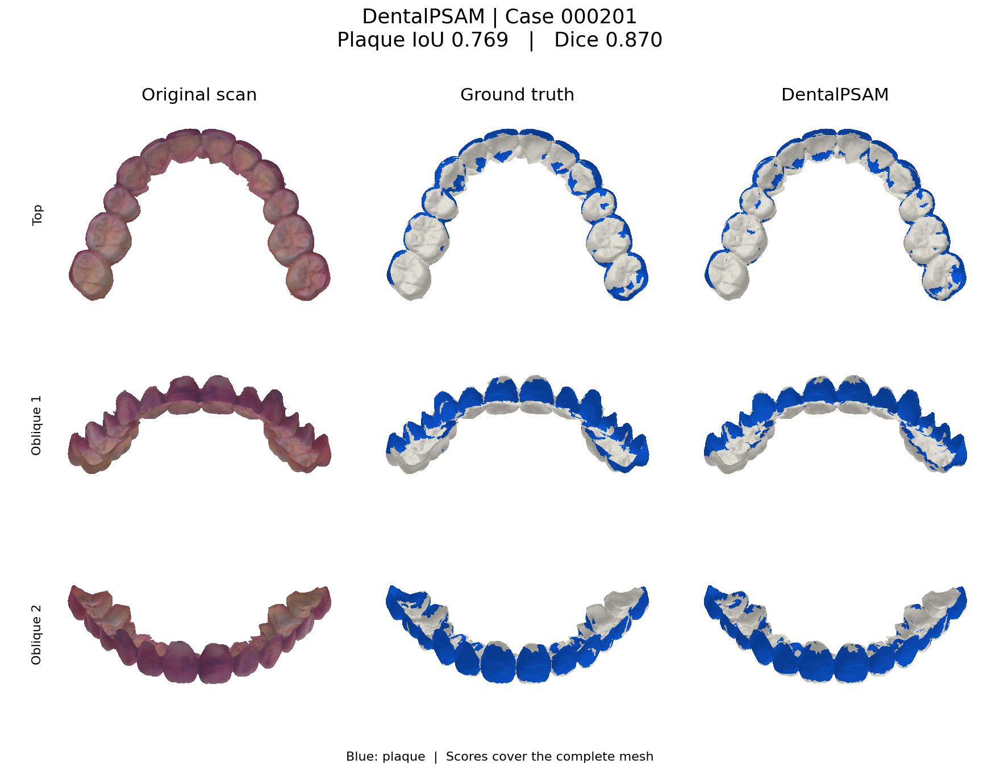
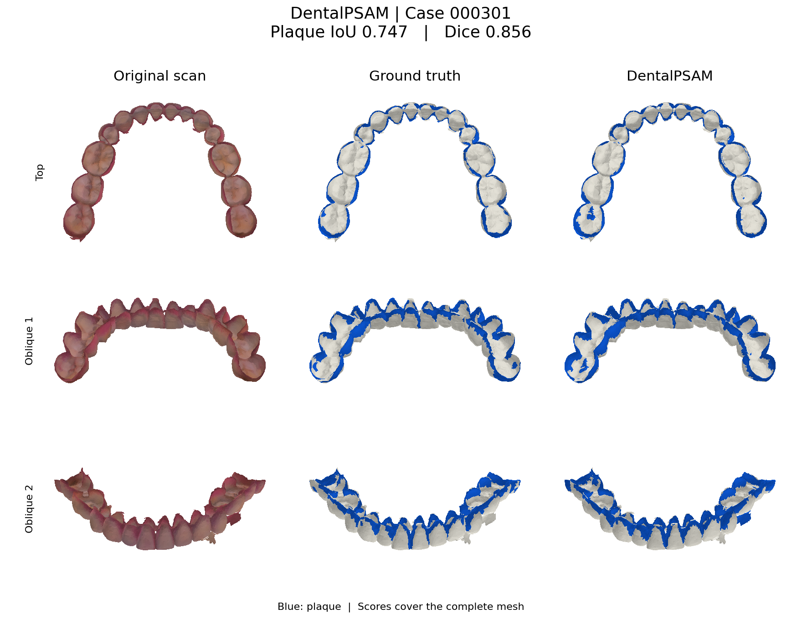

# Example cases

Three intraoral scans with plaque annotations, DentalPSAM predictions, and 3D visualizations.

## Files

| Directory | Contents |
| --- | --- |
| `cases/meshes/` | Original coloured scan meshes (PLY). |
| `cases/labels/` | Matching plaque annotations (PLY). |
| `cases/mesh_ids.txt` | Case list for prediction and visualization. |
| `results/predictions/` | Per-view 2D probabilities and `3Dpred/` mesh probabilities. |
| `results/processed/metadata/` | UV coordinates and triangle correspondence. |
| `results/meshes/` | Coloured prediction meshes for MeshLab, Blender, or Open3D. |
| `previews/` | Original scan, ground truth, and prediction comparisons. |

Case identifiers are assigned within this example collection. Blue marks plaque in the previews and coloured prediction meshes.

## Run prediction

Download the [pretrained checkpoints](https://github.com/HKU-HealthAI/DentalPSAM/releases/tag/v0.1.0) into `checkpoints/`, then run from the repository root:

```bash
python test.py --data examples/cases --weights checkpoints --output results
```

## Visualize

Render the included predictions:

```bash
python -m pip install -e ".[visualization]"
python visualize.py --data examples/cases --results examples/results --output visualizations
```

For a new prediction run, use `--results results`. The command produces comparison PNGs, coloured annotation and prediction PLY meshes, and `metrics.csv`. Display views are aligned consistently across the scan, annotation, and prediction; exported meshes retain their original coordinates.

## Case results

Scores use the complete mesh, equal triangle weights, fixed 0.5/0.5 fusion, and a strict probability threshold of 0.5.

| Case | Plaque IoU | Plaque Dice | Accuracy | Files |
| --- | ---: | ---: | ---: | --- |
| 000101 | 0.7775 | 0.8748 | 0.8778 | [Scan](cases/meshes/000101.ply) · [Label](cases/labels/000101.ply) · [Prediction](results/meshes/000101.ply) |
| 000201 | 0.7695 | 0.8697 | 0.9042 | [Scan](cases/meshes/000201.ply) · [Label](cases/labels/000201.ply) · [Prediction](results/meshes/000201.ply) |
| 000301 | 0.7475 | 0.8555 | 0.9088 | [Scan](cases/meshes/000301.ply) · [Label](cases/labels/000301.ply) · [Prediction](results/meshes/000301.ply) |

### Case 000101



### Case 000201



### Case 000301


